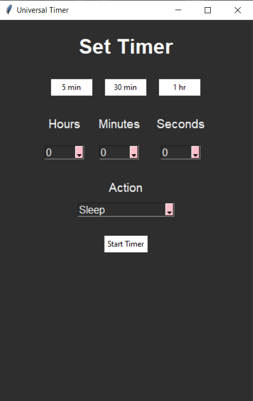
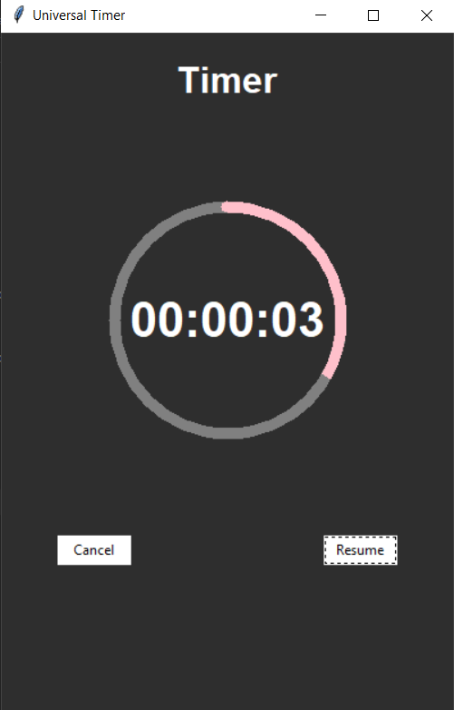

# Timer

This project is a simple and interactive Timer Application that allows users to set a timer for specific actions such as shutdown, sleep, or restart. The application features a countdown timer with options to pause, resume, or cancel the countdown.

<div style="display: flex; justify-content: space-around;">
  
  
</div>


## Features

- **User Input**: Accepts a target time (within 24 hours) and an action (shutdown, sleep, restart).
- **Countdown Timer**: Displays a countdown to the specified action.
- **Control Options**:
  - Pause the countdown.
  - Resume the countdown.
  - Cancel the countdown.
- **Actions**:
  - Automatically executes the selected action (shutdown, sleep, or restart) when the timer reaches zero.

## How to Use

### Running the Application
1. Clone this repository to your local machine.
2. Install the required dependencies using:
   ```bash
   pip install -r requirements.txt
3. Run the application:(open command prompt as administrator and go to the required directory)
   ```bash
   python app.py
### Using the Executable
1. Locate the app.exe file.
2. Run it as administrator.
3. Follow the on-screen instructions to set your timer and action.

## Building the Executable
If you want to build the executable yourself:
1. Run the following command to create an executable:
   ```bash
   pyinstaller app.py --onefile -w
2. The executable will be available in the dist folder.

## License
This project is licensed under the MIT License. See the [LICENSE](LICENSE) file for details.

## Contributing
Contributions are welcome! If you'd like to suggest features or report issues, feel free to open an issue or submit a pull request.

## Author

**Harish S**  
- LinkedIn: [harishs2312](https://www.linkedin.com/in/harishs2312)  
- Email: [harish231202@gmail.com](mailto:harish231202@gmail.com)
 


